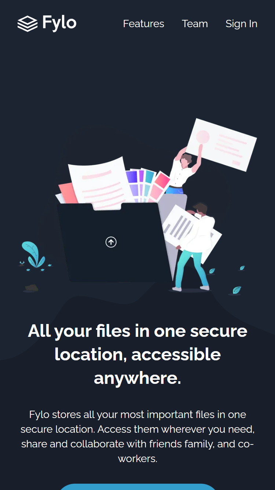
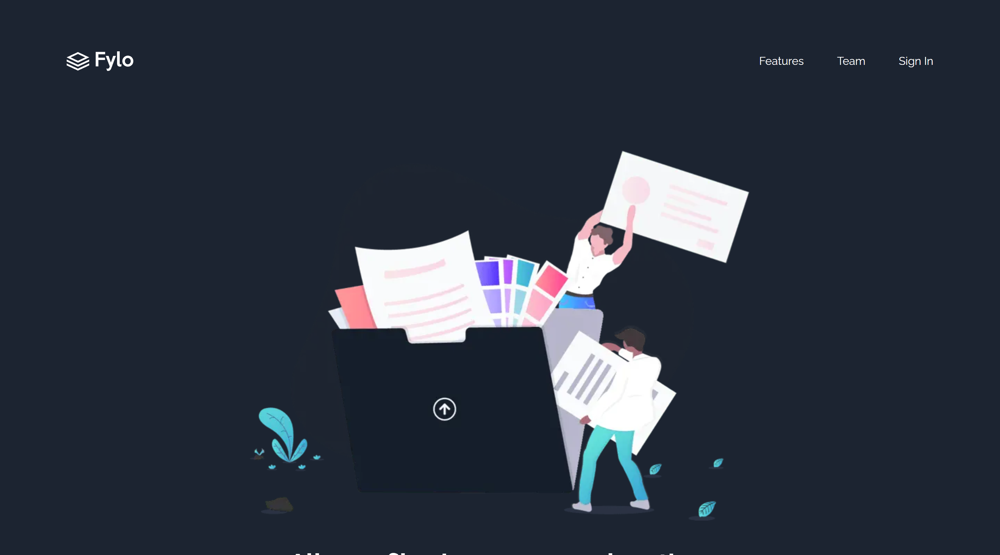

# Frontend Mentor - Fylo dark theme landing page solution

This is a solution to the [Fylo dark theme landing page challenge on Frontend Mentor](https://www.frontendmentor.io/challenges/fylo-dark-theme-landing-page-5ca5f2d21e82137ec91a50fd). Frontend Mentor challenges help you improve your coding skills by building realistic projects. 

## Table of contents

- [Overview](#overview)
  - [The challenge](#the-challenge)
  - [Screenshot](#screenshot)
  - [Links](#links)
- [My process](#my-process)
  - [Built with](#built-with)
- [Author](#author)

## Overview

### The challenge

Users should be able to:

- View the optimal layout for the site depending on their device's screen size
- See hover states for all interactive elements on the page

### Screenshot

1. Mobile view

2. Desktop view

### Links

- Solution URL: [https://github.com/sezaru-dev/fylo-landing-page](https://github.com/sezaru-dev/fylo-landing-page)
- Live Site URL: [https://fylo-landing-page-sezaru-dev.vercel.app/](https://fylo-landing-page-sezaru-dev.vercel.app/)

## My process

### Built with

- HTML5
- CSS
- Mobile-first workflow
- react-hook-form
- [React](https://reactjs.org/) - JS library
- [Next.js](https://nextjs.org/) - React framework
- [TailwindCSS](https://tailwindcss.com/) - CSS Framework

## Author

Frontend Mentor - [sezaru-dev](https://www.frontendmentor.io/profile/sezaru-dev)
